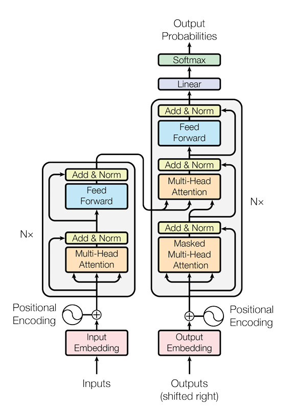

# Transformer Architecture Implementation

A PyTorch implementation of the Transformer architecture from the paper ["Attention Is All You Need"](https://arxiv.org/abs/1706.03762) by Vaswani et al. (2017).

## Architecture Diagram



The diagram above illustrates the complete Transformer architecture with:
- **Encoder (Left):** Processes input sequences with multi-head self-attention and feed-forward networks
- **Decoder (Right):** Generates output sequences using masked multi-head attention, encoder-decoder attention, and feed-forward networks
- **N×** indicates that both encoder and decoder blocks are repeated N times
- **Add & Norm:** Residual connections followed by layer normalization

## Project Structure

```
├── Decoder.py              # Decoder block implementation
├── Encoder.py              # Encoder block implementation
├── FeedForwardBlock.py     # Position-wise feed-forward network
├── inputEmbeddings.py      # Token embedding layer
├── LayerNormalization.py   # Layer normalization
├── MultiHeadAttention.py   # Multi-head attention mechanism
├── PositionalEncoding.py   # Positional encoding for sequence position
├── ProjectionLayer.py      # Final linear projection + softmax
├── ResidualConnection.py   # Residual connection with dropout
├── Transformer.py          # Complete Transformer model
└── main.py                 # Training/inference script
```

## Components

### Input Processing
- **Input Embeddings:** Converts tokens to dense vectors
- **Positional Encoding:** Adds position information to embeddings

### Encoder
- **Multi-Head Self-Attention:** Allows the model to attend to different positions
- **Feed-Forward Network:** Two linear transformations with ReLU activation
- **Residual Connections:** Add & Norm after each sub-layer
- **N=6** encoder layers (configurable)

### Decoder
- **Masked Multi-Head Attention:** Prevents attending to future positions
- **Encoder-Decoder Attention:** Attends to encoder output
- **Feed-Forward Network:** Same as encoder
- **Residual Connections:** Add & Norm after each sub-layer
- **N=6** decoder layers (configurable)

### Output
- **Linear Projection:** Maps decoder output to vocabulary size
- **Softmax:** Converts logits to probability distribution

## Usage

```python
from Transformer import Transformer

# Initialize the model
model = Transformer(
    src_vocab_size=10000,
    tgt_vocab_size=10000,
    d_model=512,
    N=6,
    h=8,
    dropout=0.1,
    d_ff=2048
)

# Forward pass
output = model(src, tgt, src_mask, tgt_mask)
```
## Requirements

- PyTorch
- NumPy
- (Add other dependencies as needed)
